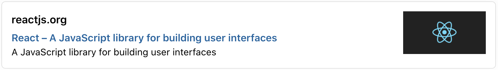

<p align="left">
  
</p>

# React Link Preview

> A component package which helps you render the preview data of any link

[](https://opensource.org/licenses/mit-license.php)
[](https://github.com/ashwamegh/react-link-preview/)
[](https://travis-ci.org/github/ashwamegh/react-link-preview/)
[](https://www.npmjs.com/package/@ashwamegh/react-link-preview) [](https://standardjs.com)
<br>
<a href="https://www.buymeacoffee.com/ashwamegh" target="_blank"></a>

> **<ins>NOTE: This utilizes https://github.com/ashwamegh/link-preview-generator-server server deployed on Azure, a free web server which can run 30 minutes in a day.</ins> If you want to use it in a PRODUCTION app, I would recommend you to use your own server (You can use the [`Dockerfile`](https://github.com/ashwamegh/link-preview-generator-server/blob/master/Dockerfile) or the [Docker hub image](https://hub.docker.com/repository/docker/ashwamegh/lpdg-server) for deploying [link-preview-generator-server](https://github.com/ashwamegh/link-preview-generator-server)) and provide the custom link of the API for `customDomain` in the Component Props**

## Demo

## Table of Contents

- [Install](#install)
- [Usage](#usage)
- [Props](#props)
- [Contribute](#contribute)
- [License](#license)

## Install

### NPM

```bash
npm install @ashwamegh/react-link-preview
```

### Yarn

```bash
yarn add @ashwamegh/react-link-preview
```

## Usage

### With built in layout

```jsx
import React from 'react'

import LinkPreview from '@ashwamegh/react-link-preview'

// If you're using built in layout, you will need to import this css
import '@ashwamegh/react-link-preview/dist/index.css'

function Example() {
  return <LinkPreview url='https://reactjs.org' />
}

export default Example
```

### With custom layout (using renderProps)

You can provide your own component to replace the existing one using renderProps.

```jsx
import React from 'react'

import LinkPreview from '@ashwamegh/react-link-preview'

function CustomComponent({ loading, preview }) {
  return loading ? (
    <h1>Loading...</h1>
  ) : (
    <div>
      <p>Domain: {preview.domain}</p>
      <p>Title: {preview.title}</p>
      <p>Description: {preview.description}</p>
      
    </div>
  )
}

function App() {
  return (
    <LinkPreview
      url='https://reactjs.org'
      customDomain='https://lpdg-server.azurewebsites.net/parse/link'
      render={CustomComponent}
    />
  )
}

export default App
```

## Props

| Property       | Type       | Default                                            | Description                                                               | Required |
| -------------- | ---------- | -------------------------------------------------- | ------------------------------------------------------------------------- | -------- |
| `url`          | `string`   |                                                    | URL to get preview data                                                   | true     |
| `onClick`      | `function` |                                                    | onClick handler for the card                                              | false    |
| `customDomain` | `string`   | `https://lpdg-server.azurewebsites.net/parse/link` | Custom Server API link which can parse the metadata of the page           | false    |
| `render`       | `function` |                                                    | function which can be called with preview data to render custom component | false    |
| `width`        | `string`   | `90%`                                              | Width of the card preview                                                 | false    |
| `maxWidth`     | `string`   | `700px`                                            | Max Width of the card preview                                             | false    |
| `marginTop`    | `string`   | `18px`                                             | Margin top for the card                                                   | false    |
| `marginBottom` | `string`   | `18px`                                             | Margin bottom for the card                                                | false    |
| `marginRight`  | `string`   | `auto`                                             | Margin right for the card                                                 | false    |
| `marginLeft`   | `string`   | `auto`                                             | Margin left for the card                                                  | false    |

## Contribute

Thanks for taking the time to contribute, please check out the [src](src) to understand how things work.

### Reporting Issues

Found a problem? Want a new feature? First of all, see if your issue or idea has [already been reported](../../issues).
If don't, just open a [new clear and descriptive issue](../../issues/new).

### Submitting pull requests

Pull requests are the greatest contributions, so be sure they are focused in scope and do avoid unrelated commits.

- Fork it!
- Clone your fork: `git clone https://github.com/<your-username>/react-link-preview`
- Navigate to the newly cloned directory: `cd react-link-preview`
- Create a new branch for the new feature: `git checkout -b my-new-feature`
- Install the tools necessary for development: `yarn`
- Make your changes.
- Commit your changes: `git commit -am 'Add some feature'`
- Push to the branch: `git push origin my-new-feature`
- Submit a pull request with full remarks documenting your changes

## License

[MIT License](https://opensource.org/licenses/MIT) © [Shashank Shekhar](https://ashwamegh.github.io)
